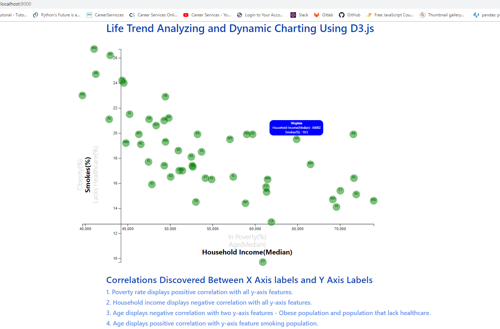

# Life Trend Analyzing and Dynamice Charting Using D3.js

This project used **HTML, CSS, Bootstrap Table, SVG, JavaScript** and **dD3.js, D3-tip.js plugin** to build an  `interactive` , `responsive` and `multi-axis` data visualization  for Life Trend Analyzing.

- - -

- - -

## Data Source

The data set [https://factfinder.census.gov/faces/nav/jsf/pages/searchresults.xhtml](https://factfinder.census.gov/faces/nav/jsf/pages/searchresults.xhtml) is based on 2014 ACS 1-year estimates, incldes data on rates of income, obesity, poverty, etc. by state. 

## Technologies Used

*  **Bootstrap Table** is used to set the layout of the webpage and it can makes a *Responsive Tables* by using `table-responsive` class. It scrolls horizontally up to small devices (under 768px) and when viewing on anything larger than 768px wide no any difference.

* **JavaScript** When a HTML page is loaded by a browser, it is converted to a hierarchical structure - *DOM* Document Object Model. JavaScript interacts with HTML elements (DOM elements) to make the web user interface *interactive*. 

* **SVG** Scalable Vector Graphics is a way to create images using text. It scales itself *dynamically* according to the size of the browser(responsive to screen size), so the image is not distorted by resizing browser.

* **D3.js** Data-Driven Documents Javascript library is used to manipulate documents based on data and allows to bind arbitrary data to a Document Object Model (DOM).

* **D3-tip.js** plugin is used to create *tooltips* by adding another layer of data to reveal a specific element's data when the user hovers cursor over the element in addtion to ticks on the axes telling approximate values for the element. 

## Project Files:

* **index.html**:  Homepage of the website. 

* **assets\js\app.js**:  Javascript code creates a dynamic interactive `Multi-Axes`(three X Axile labesl and three Y Axile labels) Visualiztion. Click different X Axile labels and Y Axile labels can analyze *specific data* on the scatter plot - *one* of the `nine` possible correlations. Each circle element represents a state with state abbraviation in it. Animation is generated through the transitions for circles' locations as well as the range of axes(three for each axis). Data-driven transformations like linear scaling is also applied to the document based on the range of axes(three for each axis), so the coordinate origin not (0,0).

* **assets\css\style.css, d3Style.css**: External style sheets which change the look of the entire website.

* **assets\data\data.csv**: Data file is read in by `d3.csv()`.

## Final Results

- - -

